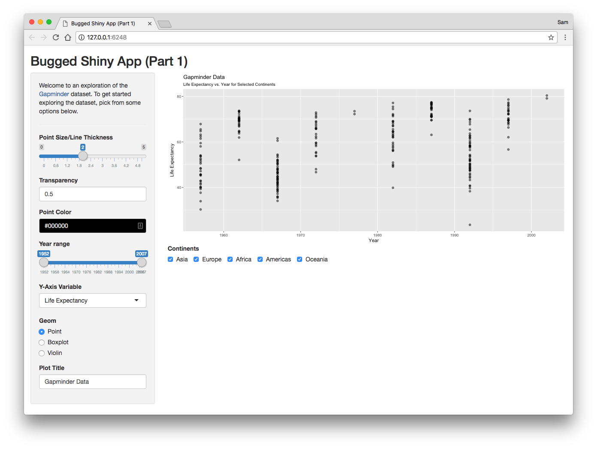
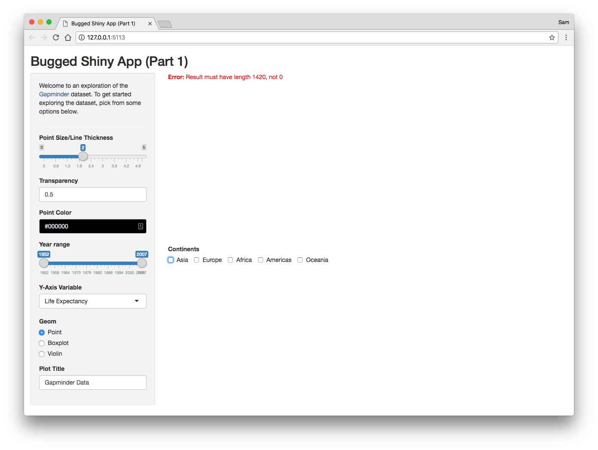
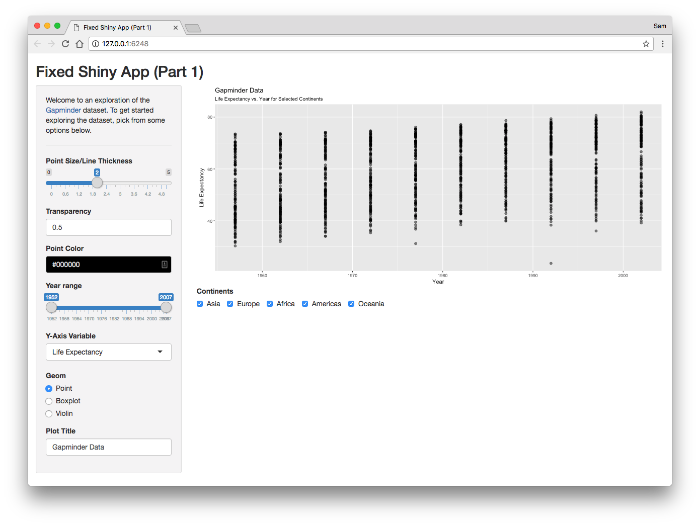
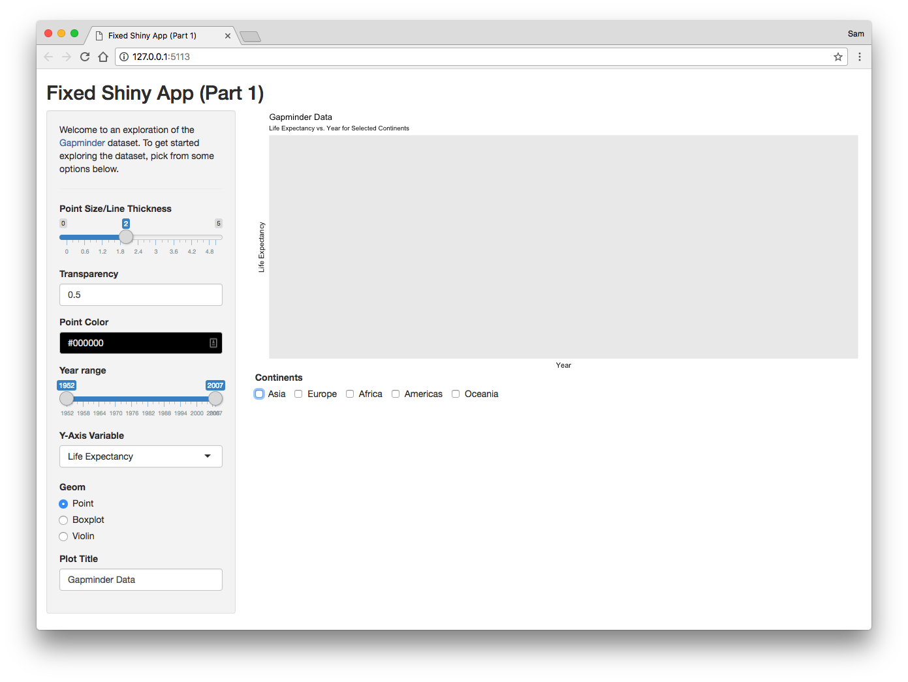
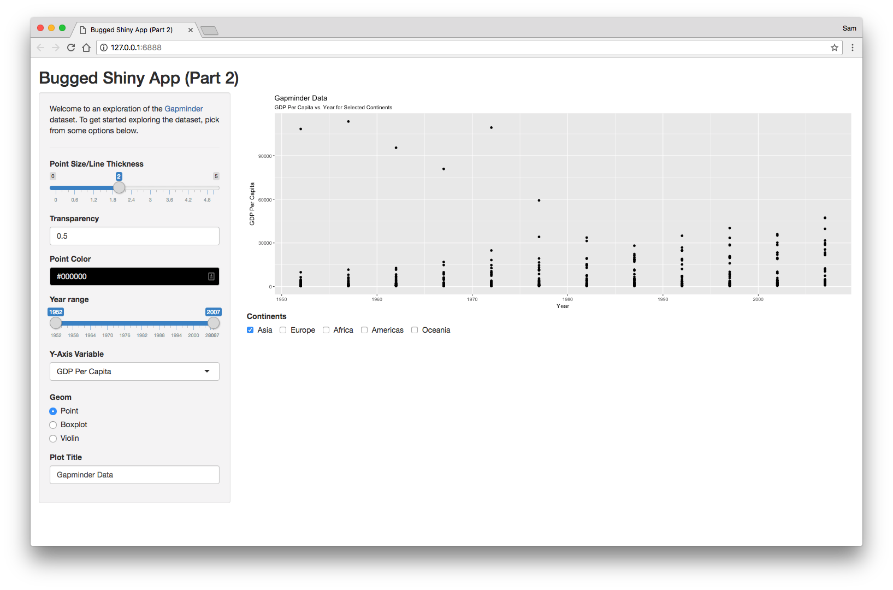
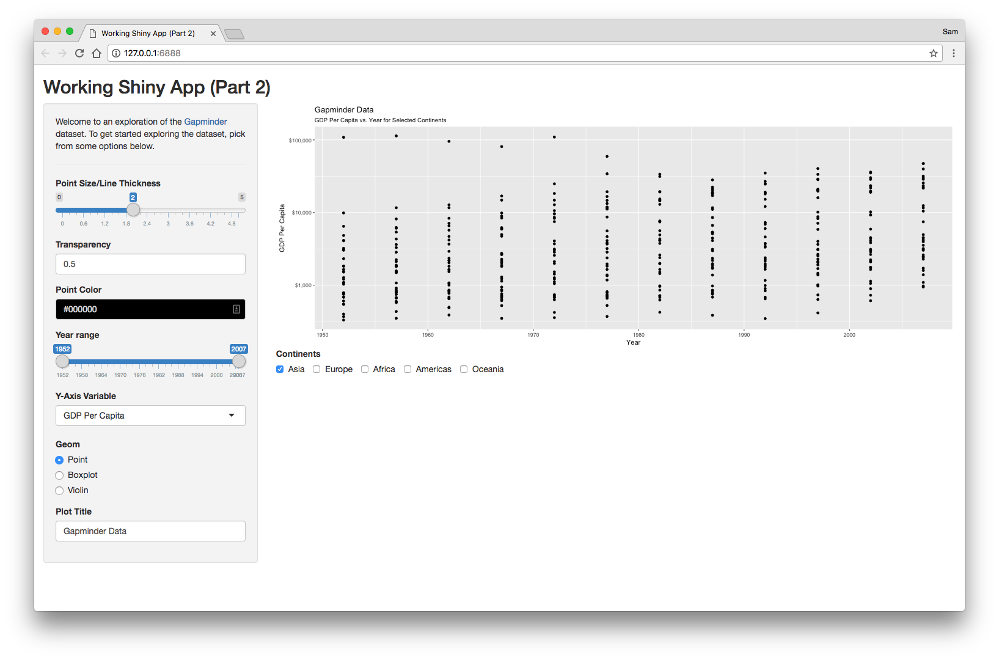

# Debugging Tutorial

_Jan 18th, 2018_

Pictured below is the Shiny app I wrote for your lab 1 solutions. However, it is broken! Let's use the RStudio debugger to figure out what is wrong.

## Part 1

### Bugged Shiny App

`part1_bugged` branch - `git checkout part1_bugged`

When we select multiple continents to display, we do not seem to get more points on the screen.

Furthermore, if we remove all the continent selections, we get an error instead of a blank plot!

### Fixed Shiny App

`part1_working` branch - `git checkout part1_working`

All continents displayed.

Gracefully displayed blank plot.

## Part 2

### Bugged Shiny App

`part2_bugged` branch - `git checkout part2_bugged`

### Working Shiny App

`part2_working` branch - `git checkout part2_working`

